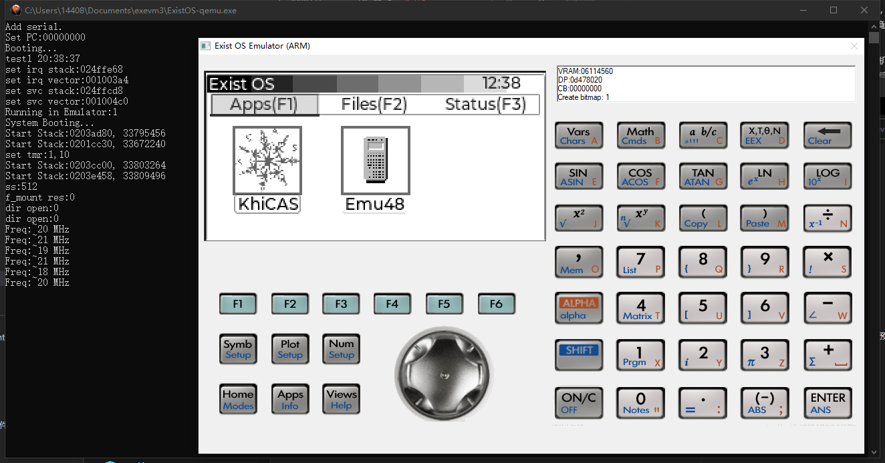

## Third party application develop

ExistOS App demo available at here:  
https://github.com/ExistOS-Team/ExistOS-App-demo

## Development Envirment

First, install `gcc-arm-none-eabi`:
|OS|Installaion|
|----|----|
|Windows|[Download from here](https://developer.arm.com/downloads/-/gnu-rm)|
|Debian|`apt-get install gcc-arm-none-eabi`|
|Ubuntu|`apt-get install gcc-arm-none-eabi`|
|Arch Linux|`pacman -Syu arm-none-eabi-gcc`|
|Others|Build from [source code](https://developer.arm.com/tools-and-software/open-source-software/developer-tools/gnu-toolchain/downloads)|

Add udev rule:
|OS|Installaion|
|----|----|
|Windows|N/A|
|Linux|`sudo cp 99-hp39gii.rules /etc/udev/rules.d/`|
||Then restart `udev`:|
||`sudo service udev restart`|
||If commands above didn't work|
||`sudo udevadm control --reload-rules`|
||`sudo udevadm trigger`|

Install compiler:
|OS|Installaion|
|----|----|
|Windows|Download [Ninja](https://github.com/ninja-build/ninja/releases) and unzip it to `PATH`|
||Download and install [CMake](https://cmake.org/download/) and add it to `PATH`|
|Debian|`apt-get install cmake make`|
|Ubuntu|`apt-get install cmake make`|
|Arch Linux|`pacman -Syu cmake make`|

Install libraries:
|OS|Installation|
|----|----|
|Windows|N/A|
|Debian|`apt-get install libcrypto++-dev libusb-1.0-0-dev`|
|Ubuntu|`apt-get install libcrypto++6 libcrypto++-dev libusb-1.0.0-dev`|
|Arch Linux|`pacman -Syu libusb crypto++`|
|Others|Install libusb 1.0，[libcrypto++](https://cryptopp.com/wiki/Linux#Distribution_Package)|

Compilete `sbtool`:
|OS|Installation|
|---|---|
|Windows|Binary excutable available at `tools/sbtools_win/`|
|Linux|`cd tools/sbtools && make`|

Compilete `sysigner`:
|OS|Installation|
|---|---|
|Windows|Binary excutable available at `tools/`|
|Linux| `mkdir tools/sys_igner/build` |
| | `cmake -S tools/sys_igner -B tools/sys_igner/build` |
| | `cmake --build tools/sys_igner/bulid` |

Comilete `edb-unix`:
|OS|Installation|
|----|----|
|Windows|Binary excuatble available at `tools/`|
|Linux|`git submodule update --remote`|
| | `mkdir tools/edb-unix/build` |
| | `cmake -S tools/edb-unix -B tools/edb-unix/build` |
| | `cmake --build tools/edb-unix/bulid` |

## Build ExistOS

```bash
mkdir build
cd build
```

Run CMake:
|OS|Installation|
|---|---|
|Windows|`cmake .. -G Ninja`|
|Linux|`cmake ..`|

Build:
|OS|Installation|
|---|---|
|Windows|`ninja`|
|Linux|`make`|

## Flash ExistOS

First, use sbtool to load OSLoader into the calculator's RAM:
|OS|Installation|
|---|---|
|Windows|`ninja sb_flash`|
|Linux|`make flash`|

After OSLoader has been running, the calculator will display the following screen saying "Could not find the System":


Right now OSLoader is only running off RAM, proceed to execute following commands to flash OSLoader to the boot sector on the flash of the calculator:
|OS|Installation|
|---|---|
|Windows|`ninja edb_flash_loader`|
|Linux|`sudo make edb_flash_loader`|

The calculator will then reboot automatically, but no system will be found. Lastly the following commands are required to flash the system onto the flash:
|OS|Installation|
|---|---|
|Windows|`ninja edb_flash_sys`|
|Linux|`sudo make edb_flash_sys`|

After the process finishes the calculator will reboot automatically and run normally. If it does not respond for an extended period of time, please try flashing from the beginning.

## ExistOS Emulator



Binary available for Windows: https://github.com/ExistOS-Team/ExistOS-Emulator/releases/tag/Latest

Source code: https://github.com/ExistOS-Team/ExistOS-Emulator

## Code Contribution

**If you want to contibute code, please follow these standards**

1. Variable

   - Variables are named using lower camel case. For example, `windowHeight`
   - Function parameter naming is the same as variable.
   - Don't name using a single letter except for temporary or loop variable.
   - It is prefered to add some meaningful prefix. For example, `p` means pointer.
   - Don't define variable and pointer at the same time on one line, such as `char *p, q;`

2. Function

   - Functions are named using underline. For example, `get_window_width`。
   - Function names should follow the Verb - object relationship.
   - It is prefered to add some meaningful prefix. For example, `is` means the type of return value is bool.
   - Short function can be defined as inline, function parameters and return values should be pointer instead of variable.
   - Avoid using recursion, consider refactoring to cycling.

3. Constant, macro and hardware-related

   - Constants and macros are named using underline to divide upper-case letters. For example, `MAX_WIDTH`。

4. Custom type

   - Custom type names are named using underline (tentative).
   - Must use typedef to define a custom type before using struct to define non-single-instance object.

5. Operator and other symbol

   - Unary operators should appress the variable, such as `c++`, `*p`.
   - Binary operators shold have spaces on both sides, such as `i == 1`, `a += 3`, except for `->`
   - Ternary are the same as binary, such as `isLeft ? 1 : 0`.
   - commas should be followed by a space.
   - Parentheses should be added appropriately where it is not easy to understand.

6. Pseudo-class

   If object-oriented is necessary, you can consider using `typedef struct` as pseudo-class.

   - Pseudo classes should be named by the upper camel case (Pascal) name.

   - For properties inside the class, its name is the same as the general variable.

   - Pseudo-class methods are not saved in pseudo-classes, but are global functions. Methods should be named using underline.

     - Normal method should be named as `ClassName_method_name`, the first parameter should always be a pointer to the instance and be named `this` (even unnecessary).

     - Static method should be named as`ClassName_static_method_name`。
     - General method named `ClassName_initializer` should be called right after an instance is defined.

7. Coding

   7.1

   ```c
   if (a == 1) {                          // There should be spaces between keywords and brackets, and spaces between brackets and curly brackets
       // code here
   }else{                                 // Use Java style
       // code here
   }
   if (b == 1) return;                    // When there is only one sentence of code in the block, you can leave a blank space without curly braces
   ```

   7.2

   ```c
   while (true)
       ;                                  // When using empty loops, you should wrap the semicolon and indent it
   ```

   7.3

   ​ (a) The loop variable of a general for loop is defined in the for loop:

   ```c
       for (int i = 0; i < l; i++) {
           // code here
       }
   ```

   ​ (b) In cases where circular variables are used externally, an initial value should also be given here:

   ```c
       int i;
       for (i = 0; i < l; i++) {
               // code here
       }
       return i;
   ```

   ​ (c) Do not leave any of the three of for loops empty: `for ( ; ; )`, otherwise use the while loop.

   7.4 Don't use assignment where a sentence needs to be judged, such as `if (a = 1), (a = 1) ? a : 0 `.

   7.5 The goto statement should be avoided as much as possible.

   7.6 Switch should be used more than else if.In a switch statement, it is best to have a break/return statement in each case, except when multiple cases share exactly the same piece of code.Care should be taken when using switch traversal and it is best to comment on it.

For VSCode users, `clang-format` extension is available to format the code conveniently.
