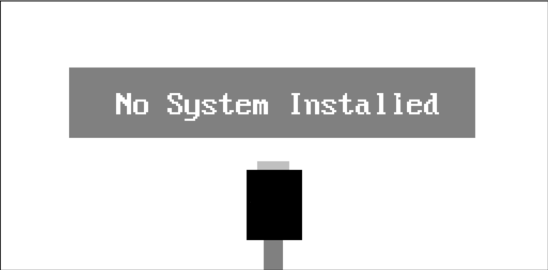

## For Windows User

### Automagicaly Install with ExistOS Updater

Download [ExistOS Updater](https://github.com/ExistOS-Team/ExistOS_Updater_v2/releases) then follow [the guide](https://github.com/ExistOS-Team/ExistOS_Updater_v2#readme) install ExistOS to your calculator.

The newest firmware is available at [here](https://github.com/ExistOS-Team/ExistOS-For-HP39GII/releases).


### Manualy Install

Please follow the Linux user guide and skip tools building:

- Download [edb.exe](https://github.com/ExistOS-Team/ExistOS-For-HP39GII/blob/main/tools/edb.exe) replace `edb-unix`
- Download [sb_loader.exe](https://github.com/ExistOS-Team/ExistOS-For-HP39GII/blob/main/tools/sbtools_win/sb_loader.exe) replace `sb_loader`
- Download [sysigner.exe](https://github.com/ExistOS-Team/ExistOS-For-HP39GII/blob/main/tools/sysigner.exe) replace `sysigner`

## Linux User

### Prepare for installaion

C/C++ libraries requires for build installaion tools:

- [Crypto++](https://cryptopp.com/wiki/Linux#Distribution_Package)
- libusb (1.0)

[Download source code of this repoistry](https://github.com/ExistOS-Team/ExistOS-For-HP39GII/archive/refs/heads/main.zip), then run `make` in follow directries:

- `tools/sbtools`
- `tools/sys_signer`

[Download source code of EDB-Unix](https://github.com/ExistOS-Team/edb-unix) and build it.

[Download binary firmware of ExistOS](https://github.com/ExistOS-Team/ExistOS-For-HP39GII/releases).

### Install ExistOS

Load `OSLoader` to calculator RAM:

```bash
# Before installing, please power off your calculator completely by removing the batteries, then plug in USB cable while holding down the `ON/C` key. Your calculator will then enter flashing mode.
# You can see if an HID device named "USB Input Device" with the ID of 066F:3770 shows up in Device Manager under Windows.
./sb_loader -f OSLoader.sb
```


The calculator will boot up and show the following screen "No System Installed":



Write `OSLoader` to calculator flash:

```bash
# EDB will mount USB device to link calculator
sudo ./edb -r -s -f OSLoader.sb 1408 b
```

Your calculator will reboot automagicaly, now flashing ExistOS to your calculator:

```bash
sudo ./edb -r -s -f ExistOS.sys 1984
```

Enjoy ExistOS!
