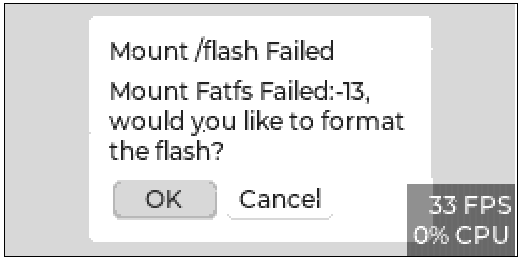
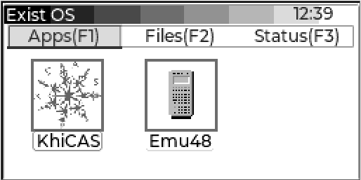
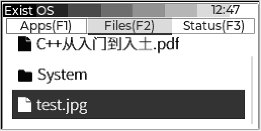
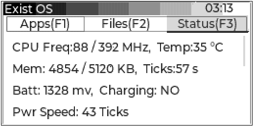
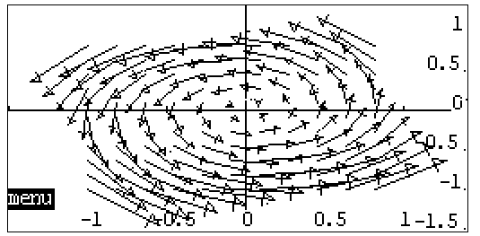
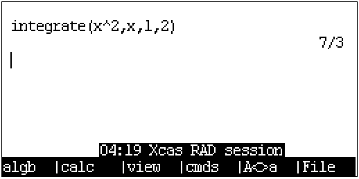
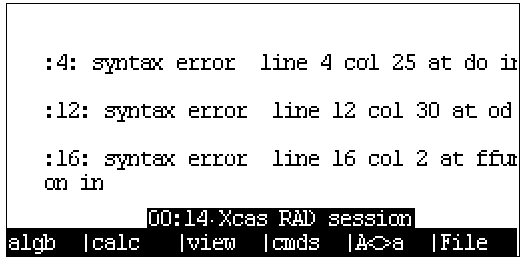
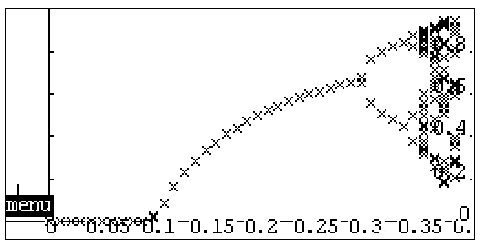

## Booting for the first time

After booting and flashing, the first time the system boots you'll see the following dialog, prompting you to format the data section of the flash as FAT16. Press `ENTER` to confirm the operation. It usually takes around 30 seconds.



This screen indicates a successful format. Select OK to enter the main menu.


The system only comes with a KhiCAS application for now. Press `←` `→` `↑` `↓` to navigate, `ENTER` to confirm, F1~F3 toggle tabs.





The Status tab currently shows the system status and preferences.




## System Shotcuts

Following shotcuts is avilable anytime (Includede system crash):

```
ON + F3: Force shutdown
ON + F5: Enter formatting interface
ON + F6: Force reboot
ON + [+]: Increase screen contrast
ON + [-]: Reduce screen contrast
```

## Accessing internal storage

Holding down `F2` while booting (or immediately after pressing `ON/C`) will bring up the following interface:


A 80 MB USB drive will then show up on the computer, which is the data section of the onboard flash. `System` directory stores assets e.g. fonts and pictures which are unused right now. `xcas` directory stores KhiCAS user scripts, sessions (history) and other information.


## Basic usage of KhiCAS

Press `↓` to select the KhiCAS app under the Application tab in the main menu, and press `ENTER` to launch. A dialog will show up on the first launch for you to choose between Xcas mode `F1` and Python mode `F6`.


After configuration, the current state is shown on the status bar below. The first item is current time, the second is mode (Xcas or Python), the third is the filename of the current session.

Note: RTC interface is not ported for now, thus time might be shown incorrectly.


Calculations may be performed after initialization.

Long press `ON/C` to clear history.

Press `SHIFT` then long press `ON/C` to save session and shutdown.

### Basic calculations

General expressions can be entered in KhiCAS to perform calculations. Calculation of large integers is supported, however for floating point calculation, only single-percision floating point numbers are supported.


For an expression entered in linear mode, select View (`F3`) to edit it in the natural textbook editor.


Press `F1` and `F2` to bring up _could-be_ commonly-used commands menu.


`cmds` menu (`F4`) lists all available commands in KhiCAS as nested entries, including algebraic, complex, polynominal, probability, plotting, etc., where you can search commands needed. After selecting the command, press `Input` to copy to the main menu, `ex1` `ex2` to copy built-in examples or `help` to show built-in help.


### Example 1: Plotting

Use `plot` command to plot functions. In the plot interface: Press `↑` `↓` `←` `→` to move the canvas, ` +``- ` to zoom, `*` to auto-zoom and fill the screen, `/` to auto-zoom and keep the scale of the axes equal.

```
  plot(expression, x)
  plot(expression, x=[start...end], xstep=step)
```


`plotpolar` command plots in polar coordinate system.


`plotfield` command draws vector fields.





### Example 2: Indefinite integrals


### Example 3: Definite integrals




### Example 4: Programming to draw Feigenbaum bifurcation diagrams mapped with Logistic equations

Two input syntax modes are present in KhiCAS, namely Xcas and Python. With the ability to execute scripts, new functions can be defined via programming. Here we use Python syntax to implement the following bifurcation diagram.


Press `File` (F6) in the main menu and select the 6th item to open the script editor.


In the editor, the top left corner shows current time, syntax mode, filename and current line/total lines. `F1`~`F3` stores shortcut commands such as symbolic conditionals, loop bodies, function definitions, etc.


The script we are using is as follows. First we define two global vectors `r` and `p`, where the result of function `f` iteration will be stored. Then we can plot by calling KhiCAS command `point(r,p)` externally.

```python
r = []
p = []
def f():
  for u in range(0, 40):
    x = 0.132456
    for n in range(1,50):
      x1 = (u/10)*x*(1-x)
      x = x1
      if n > 25:
        r.append(u/100)
        p.append(x)
  return
```

After editing, the script can be checked and compiled using the Check syntax option in the File menu, and the result will be output to the console.


The following figure shows the result of compiling a script with a symbolic error, with a specific indication of the line number. (Compiling Python scripts in Xcas mode also causes error.)



The result of a successful compilation is shown below.


The function name in the script is called to execute the function written above, and the `point` command is then called to draw the scattered data to the canvas.


Final output:




## Experimental features

### Charging (Non-fulltested)

ExistOS supports controlling the SoC's internal DCDC and linear regulator to step down the USB input to 1.4V and then output to the battery compartment for charging, so be sure to use a rechargeable battery when using this feature to prevent danger.

How to use: Switch to `Status` tab after plugging in the USB cable, scroll to the bottom and check `Enable Charge`, then the battery compartment will start to output current, the status shows that the core temperature rises to about 50℃, that's because the charging related voltage boost circuit is integrated with the CPU.


The following system condition curves were plotted during test charging with a nominal 400mAh 1.2V AAAA battery (charging time: 6 hours).


The following system condition curves were plotted during a test discharge using a nominal 400mAh 1.2V AAAA battery (discharge time: 2 hours).


## Emu48 39/48 Saturn Emulator

ExistOS can run the firmware of HP39/48 series calculators by running the Saturn virtual machine. At the moment, only the hp 39g firmware has been loaded, the exit and data saving functions are not yet completed, and no relevant optimization has been performed.

How to use: Place the firmware rom.g39 (about 1MB of size) of the HP 39g calculator in the root directory of the calculator storage, and click Emu48 in the main system application interface.

Reboot: `ON + F6`

Shutdown: `ON + F3`


