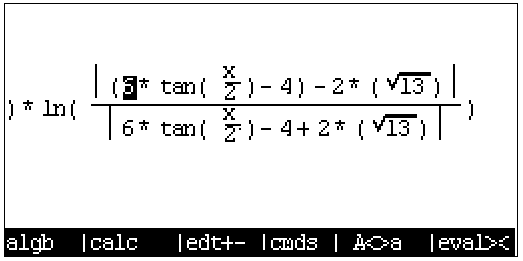

## 初次使用

系统编译和安装完成后，第一次开机将会见到如下系统界面，提示将 Flash 的数据区格式化为 FAT16 格式的文件系统，`ENTER` 点击 OK 开始格式化，大约耗时半分钟。


出现以下界面后表示 Flash 数据区已经格式化完毕，点击 OK 进入系统主界面。


目前系统预置应用如下，KhiCAS 用于进行代数计算，Emu48 目前为实验应用，用于模拟 hp39g/48g 系计算器系统（目前实现了对 39g 的基本模拟），将固件文件放入计算器后即可启动，[←][→][↑][↓]键选择，[ENTER]键确定，F1~F3 切换选项卡。


Files 选项卡为当前文件浏览器，可以浏览目录、打开 jpg 格式图片、播放 mjpeg 编码 avi 格式视频以及执行.exp 格式的 Exist APP 应用，目前暂未实现其它文件管理功能。


Status 选项卡用于显示当前系统状态，以及相关的参数设定。


## 系统快捷键

以下快捷键在任何界面均可起作用（包括系统崩溃时）

```
  ON + F3 强制关机
  ON + F5 进入格式化界面
  ON + F6 强制重启
  ON + [+] 增加屏幕对比度
  ON + [-] 减少屏幕对比度
```

## 内部存储的访问

在系统开机前（或按下 `ON/C` 开机之后立即）按住 `F2` 键不放，会出现如下界面：


屏幕出现 USB MSC Mode 字符后使用 USB 线缆接入计算机即可访问存储空间，此时电脑上会出现一个约 80MB 的 U 盘，System 为系统资源（字体、图片之类，目前暂不使用），xcas 文件夹存放 KhiCAS 的用户脚本、会话(历史记录)等资料。操作完文件后务必使用安全弹出防止文件损坏，安全弹出时计算器会对写入 Flash 内容进行同步和整理，可能会出现短暂的卡顿，请耐心等待。


## KhiCAS 的基本使用

主界面 Application 选项卡中按下 `↓` 键选中 `KhiCAS` 应用，按下 `Enter` 键启动应用。第一次启动时会弹出提示选择使用 Xcas 语法模式 `F1` 还是 Python 语法模式 `F6`。


设定完成后当前状态会显示在下边的状态栏，其中第一项为当前时间，第二项为语法模式（Xcas 或 Python），第三项弧度或角度制，第四项为当前会话文件名。

使用 time(hh,mm) 命令设置时间(24 时计时)，例如 time(11,45) 表示设置时间为 11:45


初始化完成后便可以进行一些相关的计算。

[ON/C]清除历史记录。

[SHIFT]+[ON/C]保存会话并关机。

### 基本计算

在 KhiCAS 中可以输入一般的表达式进行计算，支持大整数计算，但对于小数仅支持单精度浮点。


对于输入的表达式（或 `↑` `↓` 键选择的历史记录）可以按下 View 键 `F3` 后将其转化为自然输入模式进行编辑。


使用 `F1` 和 `F2` 键可以调出可能常用的指令菜单。


`cmds` 菜单 (`F4`) 里用二级目录的方式列出了 KhiCAS 中的全部命令（包括代数、复数、多项式、概率、绘图等命令），可以在其中搜寻需要的指令，选中对应的指令后 `input` 键输入到主界面，或按下 `help` 查看指令帮助，`ex1`、`ex2` 键输入自带的示例。


### 示例 1: 绘图

使用 `plot` 命令可以对基本函数进行绘图，绘图界面 `↑` `↓` `←` `→` 键移动画布，`+` `-` 键缩放，`*` 键自动缩放铺满屏幕，`/` 键自动缩放让 x y 坐标刻度等距。

```
  plot(表达式, x)
  plot(表达式, x=[起点...终点], xstep=步进)
```


`plotpolar` 命令则在极坐标系下绘图


`plotfield` 绘制矢量场


### 示例 2: 不定积分




### 示例 3: 定积分


### 示例 4: 编程绘制 Logistic 方程映射 Feigenbaum 分岔图

在 KhiCAS 中有两种语法工作模式 Xcas 和 Python，并提供了脚本执行功能，因此可以通过编程的方式定义新函数，这里使用 Python 语法来实现绘制如下的分岔图。


在主界面中按下 File 键 (`F6`)，选择第六项打开脚本编辑器。


脚本编辑器中，左上角显示当前时间，语法模式，文件名，当前编辑行号/总行数。
`F1`~`F3`中存储了一些如符号判断、循环体、函数定义等的快捷命令


这里使用的脚本如下，首先先定义了两个全局向量 `r` 和 `p` ，函数 `f` 迭代的结果会存储在这两个向量中，最后在外部能够调用 KhiCAS 的 `point(r,p)` 命令进行绘图。

```python
r = []
p = []
def f():
  for u in range(0, 40):
    x = 0.132456
    for n in range(1,50):
      x1 = (u/10)*x*(1-x)
      x = x1
      if n > 25:
        r.append(u/100)
        p.append(x)
  return
```

编辑完成后使用 File 菜单里的 Check syntax 选项可以对脚本进行检查和编译，结果会输出到主控制台上。


如下图为脚本有符号错误时编译的结果，会具体提示所在行号（或者是在 Xcas 模式下编译 Python 脚本也会出现错误）


编译成功的结果如下图。


随后调用脚本中的函数名执行上面所写的函数，执行完后再调用 point 指令将迭代输出的散点绘制到画布上。


最终输出：


## 实验性功能说明

## 充电功能（未完全测试）

目前固件支持通过控制 SoC 内部 DCDC 和线性稳压器从 USB 取电，降压到 1.4V 后输出给电池仓进行充电，因此使用该功能时务必使用可充电电池，以防发生危险。

使用方法：接入 USB 线后切换到`Status`界面，滚动至最底部勾选`Enable Charge`后电池仓开始输出电流，查看上面显示信息可以看到核心温度上升至 50℃ 左右，这是因为充电相关的升降压电路是和 CPU 集成在同一芯片内。


以下是使用一节标称 400mAh 1.2V AAAA 电池测试充电时绘制的系统状况曲线（充电时间：6 小时）：


以下是使用一节标称 400mAh 1.2V AAAA 电池测试放电时绘制的系统状况曲线（放电时间：2 小时）：


## Emu48 39/48 Saturn 模拟器

该功能可以通过运行 Saturn 虚拟机的方式运行 HP39/48 系列计算器的固件，目前仅完成了 hp 39g 固件的加载，退出和数据保存功能还未完成，且未进行相关优化，速度较慢。

使用方法：将 HP 39g 计算器的固件 rom.g39 (1MB) 放置到计算器存储空间的根目录下，在系统应用主界面点击 Emu48 后即可使用，故载入速度较慢，请耐心等待。

重启：`ON + F6`

关机：`ON + F3`


